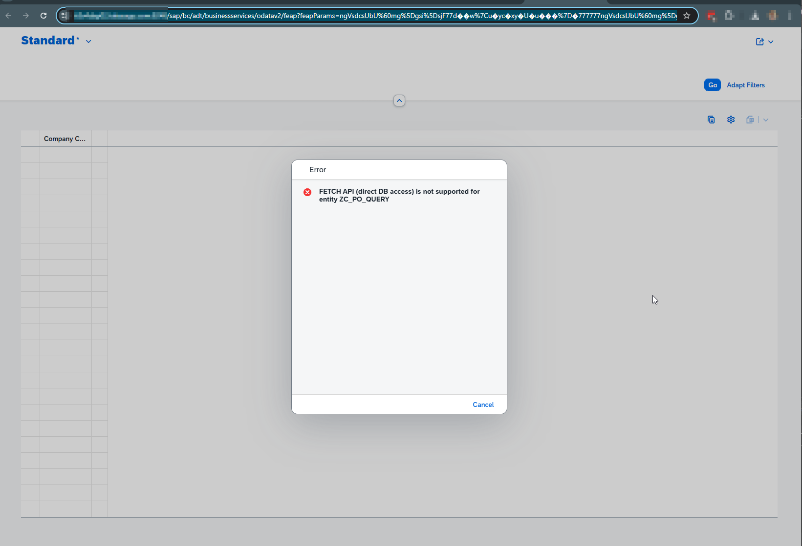

# sap-rap-alv


| Produto                        | Release | Pilha SP         | Fabricante | Descrição breve do produto                  |
|--------------------------------|---------|------------------|------------|----------------------------------------------|
| S4HANA ON PREMISE              | 2023    | 03 (02/2025) FPS | sap.com    | SAP S/4HANA 2023                             |
| SAP S/4HANA FOUNDATION         | 2023    | 03 (02/2025) FPS | sap.com    | SAP S/4HANA FOUNDATION 2023                  |
| SAP FIORI FES FOR S/4HANA      | 2023    | 03 (02/2025)     | sap.com    | SAP FIORI FES 2023 FOR S/4HANA               |
| SAP FIORI FOR S4HANA           | 2023    | 03 (02/2025) FPS | sap.com    | SAP FIORI FOR SAP S/4HANA 2023               |
| ABAP PLATFORM                  | 2023    | 03 (02/2025)     | sap.com    | ABAP PLATFORM 2023                           |

---

O que falta é apenas:

- ✅ ~~Publish do Service Binding~~ — **feito via `/IWFND/V4_ADMIN`**
- ⏳ Criar catálogo e Target Mapping no Launchpad — **bloqueado pelo cliente Customizing**
- ⏳ Testar a app ALP completa — **depende do ponto anterior**

---

Resumindo o estado do projeto:

| Artefato | Estado |
|---|---|
| `ZI_PO_DIM_SUPPLIER` | ✅ Ativo |
| `ZI_PO_CUBE` | ✅ Ativo |
| `ZC_PO_QUERY` | ✅ Ativo |
| `ZC_PO_QUERY` (Metadata Extension) | ✅ Ativo |
| `ZSD_PO_ANALYSIS` | ✅ Ativo |
| `ZSB_PO_ANALYSIS_UI` | ✅ Ativo e Publicado |
| Launchpad Target Mapping | ⏳ Aguarda Basis |
| Teste ALP | ⏳ Aguarda Basis |

---

# SAP RAP - Analytical List Page (ALP) com Purchase Orders

Guia passo a passo para criar uma aplicação ALP no SAP S/4HANA 2023 on-premise usando o RAP (RESTful ABAP Programming Model).

## Ambiente

| Produto | Release | SP |
|---|---|---|
| S/4HANA ON PREMISE | 2023 | 04 (08/2025) |
| ABAP PLATFORM | 2023 | 04 (08/2025) |
| SAP FIORI FOR S4HANA | 2023 | 04 (08/2025) |

## Visão Geral

O ALP é um floor plan do Fiori Elements que combina:
- **KPI Cards** no topo
- **Gráfico interativo** no meio
- **Tabela de dados** em baixo (reage aos filtros do gráfico)

É 100% **read-only** — o objetivo é análise e visualização, não edição de dados.

## Arquitetura (3 camadas)

```
ZI_PO_DIM_SUPPLIER   ← Dimension View (dados do fornecedor)
ZI_PO_CUBE           ← Cube View (dados de PO + medidas)
ZC_PO_QUERY          ← Query View (consumo no ALP)
ZSD_PO_ANALYSIS      ← Service Definition
ZSB_PO_ANALYSIS_UI   ← Service Binding (OData V4 - UI)
ZC_PO_QUERY (DDLX)   ← Metadata Extension (anotações UI)
```

---

## Artefato 1 — Dimension View

**Nome:** `ZI_PO_DIM_SUPPLIER`  
**Tipo:** Data Definition  
**Tabela base:** `lfa1`

```abap
@AccessControl.authorizationCheck: #NOT_REQUIRED
@EndUserText.label: 'PO Analysis - Supplier Dimension'

@Analytics.dataCategory: #DIMENSION
@VDM.viewType: #BASIC

define view entity ZI_PO_DIM_SUPPLIER
  as select from lfa1
{
  key lfa1.lifnr as Supplier,
      lfa1.name1 as SupplierName,
      lfa1.land1 as Country,
      lfa1.ort01 as City
}
```

---

## Artefato 2 — Cube View

**Nome:** `ZI_PO_CUBE`  
**Tipo:** Data Definition  
**Tabelas base:** `ekko`, `ekpo`  
**Depende de:** `ZI_PO_DIM_SUPPLIER`

```abap
@AccessControl.authorizationCheck: #NOT_REQUIRED
@EndUserText.label: 'PO Analysis - Cube'

@Analytics.dataCategory: #CUBE
@VDM.viewType: #BASIC

define view entity ZI_PO_CUBE
  as select from ekko
  inner join ekpo on ekpo.ebeln = ekko.ebeln
  association [0..1] to ZI_PO_DIM_SUPPLIER as _Supplier
    on $projection.Supplier = _Supplier.Supplier
{
  key ekko.ebeln                                             as PurchaseOrder,
  key ekpo.ebelp                                             as PurchaseOrderItem,
      ekko.bukrs                                             as CompanyCode,
      ekko.ekgrp                                             as PurchasingGroup,
      @ObjectModel.foreignKey.association: '_Supplier'
      ekko.lifnr                                             as Supplier,
      ekko.bedat                                             as DocumentDate,
      ekko.waers                                             as Currency,
      ekko.bstyp                                             as DocumentCategory,
      ekko.statu                                             as Status,
      substring( cast( ekko.bedat as abap.char(8) ), 1, 6 ) as YearMonth,

      @Semantics.amount.currencyCode: 'Currency'
      @Aggregation.default: #SUM
      ekpo.netwr                                             as NetValue,

      _Supplier
}
```

> **Nota:** `@Aggregation.default: #SUM` no `NetValue` define o campo como medida. Todos os outros campos são tratados automaticamente como dimensões pelo `#CUBE`.

---

## Artefato 3 — Query View

**Nome:** `ZC_PO_QUERY`  
**Tipo:** Data Definition  
**Depende de:** `ZI_PO_CUBE`

```abap
@AccessControl.authorizationCheck: #NOT_REQUIRED
@EndUserText.label: 'PO Analysis - Query'
@Metadata.allowExtensions: true

@Analytics.query: true
@VDM.viewType: #CONSUMPTION

define view entity ZC_PO_QUERY
  as select from ZI_PO_CUBE
{
  key PurchaseOrder,
  key PurchaseOrderItem,
      CompanyCode,
      PurchasingGroup,
      Supplier,
      DocumentDate,
      YearMonth,
      DocumentCategory,
      Status,
      Currency,

      @Semantics.amount.currencyCode: 'Currency'
      @Aggregation.default: #SUM
      NetValue,

      /* Textos via association */
      _Supplier.SupplierName,
      _Supplier.Country
}
```

> **Nota:** `@Analytics.query: true` é a annotation que habilita o ALP. `@Metadata.allowExtensions: true` é obrigatório para a Metadata Extension funcionar.

---

## Artefato 4 — Metadata Extension

**Nome:** `ZC_PO_QUERY`  
**Tipo:** Metadata Extension  
**Depende de:** `ZC_PO_QUERY` (Data Definition com `@Metadata.allowExtensions: true`)

```abap
@Metadata.layer: #CUSTOMER

@UI.headerInfo: {
  typeName: 'Purchase Order',
  typeNamePlural: 'Purchase Orders'
}

@UI.chart: [{
  qualifier: 'NetValueByGroup',
  title: 'Net Value by Purchasing Group',
  chartType: #BAR,
  dimensions: ['PurchasingGroup'],
  measures: ['NetValue']
}]

@UI.presentationVariant: [{
  qualifier: 'Default',
  sortOrder: [{ by: 'NetValue', direction: #DESC }],
  visualizations: [{
    type: #AS_CHART,
    qualifier: 'NetValueByGroup'
  }]
}]

annotate view ZC_PO_QUERY with
{
  @UI.lineItem: [{ position: 10, label: 'PO Number' }]
  @UI.selectionField: [{ position: 10 }]
  PurchaseOrder;

  @UI.lineItem: [{ position: 20, label: 'Item' }]
  PurchaseOrderItem;

  @UI.lineItem: [{ position: 30, label: 'Company Code' }]
  @UI.selectionField: [{ position: 20 }]
  CompanyCode;

  @UI.lineItem: [{ position: 40, label: 'Purch. Group' }]
  @UI.selectionField: [{ position: 30 }]
  PurchasingGroup;

  @UI.lineItem: [{ position: 50, label: 'Supplier' }]
  @UI.selectionField: [{ position: 40 }]
  Supplier;

  @UI.lineItem: [{ position: 60, label: 'Supplier Name' }]
  SupplierName;

  @UI.lineItem: [{ position: 70, label: 'Doc. Date' }]
  @UI.selectionField: [{ position: 50 }]
  DocumentDate;

  @UI.lineItem: [{ position: 80, label: 'Year/Month' }]
  YearMonth;

  @UI.lineItem: [{ position: 90, label: 'Net Value' }]
  NetValue;

  @UI.lineItem: [{ position: 100, label: 'Currency' }]
  Currency;
}
```

---

## Artefato 5 — Service Definition

**Nome:** `ZSD_PO_ANALYSIS`  
**Tipo:** Service Definition

```abap
@EndUserText.label: 'PO Analysis - Service Definition'
define service ZSD_PO_ANALYSIS {
  expose ZC_PO_QUERY as PurchaseOrderAnalysis;
}
```

---

## Artefato 6 — Service Binding

**Nome:** `ZSB_PO_ANALYSIS_UI`  
**Tipo:** Service Binding

| Campo | Valor |
|---|---|
| Name | `ZSB_PO_ANALYSIS_UI` |
| Description | `PO Analysis - Service Binding` |
| Binding Type | `OData V4 - UI` |
| Service Definition | `ZSD_PO_ANALYSIS` |

---

## Publicar o Serviço

### Opção A — Pelo ADT (requer cliente de desenvolvimento)
1. Abrir o `ZSB_PO_ANALYSIS_UI` no ADT
2. Clicar em **Publish**

### Opção B — Pela transação `/n/IWFND/V4_ADMIN` (alternativa para clientes Customizing)
1. Aceder à transação `/n/IWFND/V4_ADMIN` no SAP GUI
2. Clicar em **Publish Service Groups**
3. Selecionar o **System Alias** e clicar em **Get Service Groups**
4. Selecionar o grupo correspondente ao serviço `ZSD_PO_ANALYSIS`
5. Clicar em **Publish Service Groups**
6. Voltar ao ADT e fazer **F5 (Refresh)** no Service Binding — o serviço aparecerá como publicado

> **Nota:** Se o Publish no ADT falhar com o erro `"Publishing in Customizing Client not allowed"`, significa que o cliente SAP não está configurado como cliente de desenvolvimento. Consultar a secção [Troubleshooting](#troubleshooting) abaixo.

---

## Troubleshooting

### Erro: "(Un-)Publishing of SRVB in Customizing Client not allowed"

Ao tentar publicar o Service Binding pelo ADT (botão **Publish**), o sistema retorna:

```
Publishing local service endpoint of Service Binding "ZSB_PO_ANALYSIS_UI" has encountered a problem.
Local Publish of ZSB_PO_ANALYSIS_UI failed

(Un-)Publishing of SRVB ZSB_PO_ANALYSIS_UI in Customizing Client not allowed
```


**Causa raiz:** O client role na transação `SCC4` está configurado como **C — Customizing** (ou a opção "Changes and transports for client-specific objects" está definida como "Automatic recording of changes" ou "No changes allowed"). Nesta configuração, o ADT não consegue publicar serviços OData V4 localmente.

**Referência SAP:** [SAP Note 3101976](https://me.sap.com/notes/3101976) — *Publishing OData V4 service is throwing error: Publishing of XXXXXXXXXX in Customizing Client not allowed*

**Soluções:**

| # | Solução | Quando usar |
|---|---|---|
| 1 | **Usar `/IWFND/V4_ADMIN`** | ✅ Recomendada — funciona sem alterar configurações do client |
| 2 | **Alterar o client role na `SCC4`** | Requer Basis e pode não ser viável em ambientes controlados |

#### Solução 1 — Publicar via `/IWFND/V4_ADMIN` (Recomendada)

1. **Ativar** o Service Binding no ADT (isto cria o service group automaticamente, mas **não clicar** em Publish)
2. No SAP GUI, executar a transação **`/n/IWFND/V4_ADMIN`**
3. Clicar em **Publish Service Groups**
4. Selecionar o **System Alias** (ex: `LOCAL`) e clicar em **Get Service Groups**
5. Selecionar o grupo correspondente (ex: `ZSB_PO_ANALYSIS_UI`) e clicar em **Publish Service Groups**
6. Se o client estiver com "Automatic recording of changes", o sistema solicitará um **Customizing Transport Request**
7. Voltar ao ADT e fazer **F5 (Refresh)** no Service Binding — o estado mudará para **Published**

#### Solução 2 — Alterar o Client Role na SCC4

> ⚠️ **Atenção:** Esta alteração afeta todo o client e requer autorização de Basis. Não recomendada em ambientes de qualidade ou produção.

1. Executar a transação **`SCC4`**
2. Selecionar o client e clicar em **Change**
3. Alterar o **Client Role** de **C — Customizing** para **D — Development/Test** (ou equivalente que permita alterações)
4. Gravar e voltar ao ADT para publicar normalmente

### Erro: "FETCH API (direct DB access) is not supported for entity ZC_PO_QUERY"

Ao tentar fazer **Preview** do Service Binding no ADT (tanto OData V4 como V2), o sistema retorna:

```
FETCH API (direct DB access) is not supported for entity ZC_PO_QUERY
An exception was raised
```



**Causa raiz:** A annotation `@Analytics.query: true` na Query View transforma a CDS view entity numa **entidade transiente** (transient entity). Entidades transientes não geram uma SQL view na base de dados — elas só podem ser consumidas pelo **Analytics Engine (OLAP)** do SAP. O preview do ADT tenta fazer um acesso SQL directo (FETCH API), que não é suportado para este tipo de entidade.

**Importante:** Este erro ocorre **independentemente da versão OData** (V2 ou V4). Não é um problema do protocolo — é uma limitação do preview do ADT com entidades analíticas.

**Referências:**
- [SAP Community — CDS Data Model for Analytical List Page](https://community.sap.com/t5/technology-q-a/cds-data-model-for-analytical-list-page/qaq-p/13900553)
- [SAP Community — FETCH API not supported for entity (BTP)](https://community.sap.com/t5/technology-q-a/abap-enviornment-in-btp-fetch-api-direct-db-access-is-not-supported-for/qaq-p/13596667)

**Soluções:**

| # | Solução | Quando usar |
|---|---|---|
| 1 | **Testar via Fiori Launchpad** | ✅ Caminho standard — requer catálogo, target mapping e tile configurados |
| 2 | **Remover `@Analytics.query: true`** | Alternativa — usar apenas `@Aggregation.default` nos campos de medida |
| 3 | **Validar metadata via URL** | Verificação parcial — confirma que o serviço está publicado e funcional |

#### Solução 1 — Testar via Fiori Launchpad (Caminho Standard)

O ALP com `@Analytics.query: true` **só funciona correctamente quando executado via Fiori Launchpad**, onde o Analytics Engine (OLAP) é invocado. Para isso, é necessário:

1. Service Binding **publicado** (via ADT ou `/IWFND/V4_ADMIN`)
2. **Catálogo** criado no Fiori Launchpad (`/UI2/FLPD_CUST`)
3. **Target Mapping** configurado (Semantic Object + Action)
4. **Tile** criado no catálogo
5. Catálogo **atribuído a um role** (`PFCG`)

> ⚠️ Em ambientes com client role **C — Customizing**, os passos 2-5 podem estar bloqueados e requerem intervenção do Basis.

#### Solução 2 — Remover `@Analytics.query: true` (Alternativa)

Para cenários onde o preview no ADT é necessário (POC, desenvolvimento, testes rápidos), é possível construir um ALP **sem** a annotation `@Analytics.query: true`. Basta manter os campos de medida anotados com `@Aggregation.default: #SUM` na CDS view de consumo:

```abap
@Semantics.amount.currencyCode: 'Currency'
@Aggregation.default: #SUM
NetValue,
```

Com esta abordagem:
- ✅ O preview do ADT funciona
- ✅ O ALP exibe gráficos, filtros e tabela
- ✅ Compatível com RAP e Fiori Elements
- ❌ Perde funcionalidades avançadas do motor OLAP (exception aggregation, calculated measures OLAP-specific)

> **Nota:** Vários ALPs standard da SAP utilizam esta abordagem sem `@Analytics.query: true`, usando apenas as annotations `@Aggregation.default` nos campos de medida e `@Analytics.dataCategory: #CUBE` na view base.

#### Solução 3 — Validar Metadata via URL (Verificação Parcial)

Mesmo sem conseguir fazer preview completo, é possível confirmar que o serviço está correctamente publicado acedendo à URL do metadata no browser:

```
/sap/opu/odata4/sap/zsb_po_analysis_ui/srvd/sap/zsd_po_analysis/0001/$metadata
```

Se o metadata for retornado com as entidades e annotations esperadas, o serviço está funcional e pronto para ser consumido pelo Fiori Launchpad.

---

## Testar a Aplicação

> ⚠️ **Atenção:** Se a Query View utiliza `@Analytics.query: true`, o **preview do ADT não funciona** (ver [Troubleshooting](#erro-fetch-api-direct-db-access-is-not-supported-for-entity-zc_po_query)). O teste deve ser feito via **Fiori Launchpad**.

### Via Fiori Launchpad (obrigatório para `@Analytics.query: true`)

1. Configurar catálogo, target mapping e tile no Launchpad
2. Aceder ao Fiori Launchpad e abrir a app pelo tile

### Via Preview do ADT (apenas sem `@Analytics.query: true`)

Clicar em **Preview...** na entidade `PurchaseOrderAnalysis` dentro do Service Binding no ADT.

### Validar o Serviço via URL

A URL do serviço segue o padrão:
```
/sap/opu/odata4/sap/zsb_po_analysis_ui/srvd/sap/zsd_po_analysis/0001/
```

---

## Ordem de Ativação

Respeitar sempre esta ordem:

```
1. ZI_PO_DIM_SUPPLIER
2. ZI_PO_CUBE
3. ZC_PO_QUERY  (Data Definition)
4. ZC_PO_QUERY  (Metadata Extension)
5. ZSD_PO_ANALYSIS
6. ZSB_PO_ANALYSIS_UI
```

---

## Notas Importantes

- Em **ABAP Cloud** (BTP/S/4HANA Cloud), tabelas físicas como `EKKO`, `EKPO`, `LFA1` **não são permitidas**. Usar as Released APIs: `I_PurchaseOrderAPI01`, `I_PurchaseOrderItemAPI01`, `I_Supplier`.
- Em **S/4HANA on-premise**, tabelas físicas são permitidas.
- A annotation `@Analytics.dimension` pode não estar disponível em todos os releases on-premise. O sistema infere dimensões automaticamente pelo `@Analytics.dataCategory: #CUBE`.
- O ALP é **100% read-only** — para edição, navegar para um Object Page separado.
